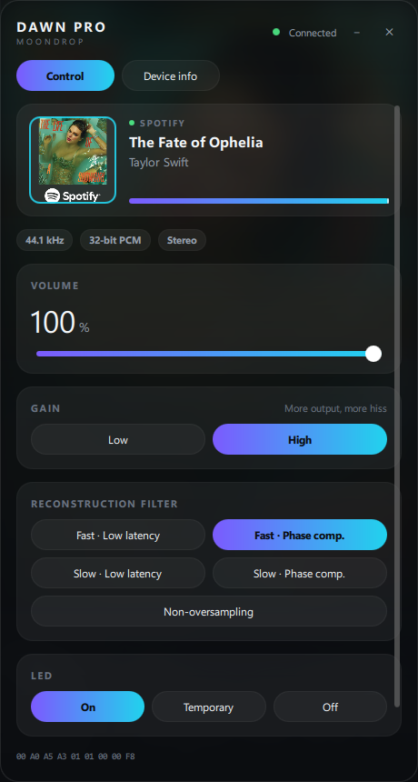
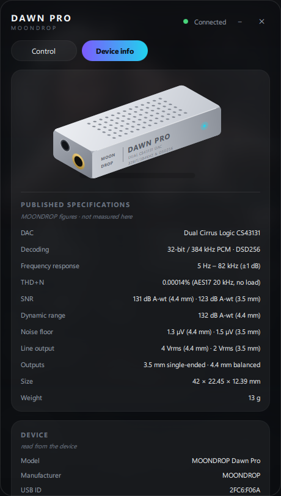

# moondrop-dawn-pro-gui

Control the **volume**, **gain**, **reconstruction filter** and **LED** of a
MOONDROP Dawn Pro from Windows — with a desktop app, a CLI, and a Python API.

No kernel driver, no Zadig, no driver replacement: the Dawn Pro is USB Audio
Class compliant, so Windows already handles the audio. Only the settings live
behind an undocumented vendor protocol, and that is what this speaks.

Built and verified against real hardware (USB `2FC6:F06A`).

## Download

**[⬇ Get the latest release](https://github.com/RetR0-hex/moondrop-dawn-pro-gui/releases/latest)**

| File | What it is |
|------|------------|
| `MoondropDawnPro-GUI.exe` | The GUI. Double-click and go. |
| `MoondropDawnPro-CLI.exe` | The command line tool. |

Single-file executables — no Python, no dependencies, no installer. Windows 10
or later, 64-bit. They are unsigned, so SmartScreen will warn about an unknown
publisher: "More info" → "Run anyway".

## Screenshots

| Control | Device info |
|---------|-------------|
|  |  |

## Features

- **Volume** — 61 steps, percentages, relative nudges, or a raw attenuation code.
- **Gain** — low / high.
- **Filter** — all five reconstruction filters.
- **LED** — on / temporarily off / off.
- **Now playing** — track, artist and album art from whatever Windows is playing,
  with a live output level meter and the negotiated stream format.
- **Device info** — USB and HID details read from the device, the PCM formats it
  accepts in exclusive mode, the drivers Windows has bound to it, and the
  published specifications.

Every write is read back from the device before a command returns, so success
means the setting really was applied.

## GUI

```powershell
python -m moondrop gui
```

Native desktop app (PySide6 + QML) — no web runtime, no Electron. Two pages:
**Control** for the settings and now-playing, **Device info** for everything
factual about the attached hardware.

## Command line

```powershell
moondrop status                  # everything at once

moondrop volume                  # -> 45/60 (75%, code 0x1e)
moondrop volume 45               # 0-60 steps
moondrop volume 75%              # or a percentage
moondrop volume +5               # relative, clamped
moondrop volume --code 0x20      # raw attenuation code

moondrop gain high               # low | high
moondrop filter slow-phase-compensated
moondrop filter nos              # aliases: fast, slow, nos, or 0-4
moondrop led off                 # on | temporarily-off | off

moondrop filters                 # list the filters
moondrop list                    # show the detected HID interface
```

The five filters are `fast-low-latency`, `fast-phase-compensated`,
`slow-low-latency`, `slow-phase-compensated` and `non-oversampling`.

Two things worth knowing about volume:

- **It is not the Windows volume.** The device's attenuator and the Windows
  endpoint volume are independent stages in series, so your actual level is the
  product of the two.
- **Mind your ears.** Step 60 is full output and the driver refuses nothing.

## Python API

```python
from moondrop import DawnPro

with DawnPro() as dac:
    status = dac.get_status()
    print(status.volume, status.gain_name, status.filter_label)

    dac.set_volume("75%")
    dac.set_gain("low")
    dac.set_filter("non-oversampling")
```

`set_*` raises `ProtocolError` if the device did not apply the value,
`DeviceNotFound` when nothing is attached, and `ValueError` on a bad name.

## Protocol

The Dawn Pro exposes one HID interface (`MI_02`) carrying a 7-byte vendor
channel alongside its media keys. Commands are `C0 A5 <command> <value>`:

| Command | Effect |
|---------|--------|
| `01` | filter (0-4) |
| `02` | gain (0 low, 1 high) |
| `04` | volume (attenuation code, `0x00` loudest) |
| `06` | LED (0 on, 1 temporarily off, 2 off) |
| `A3` | read status |
| `A2` | read volume |

One Windows quirk is worth recording, because it makes the interface look dead:
it never delivers its input report through `ReadFile`, so `hid.read()` always
times out. Replies have to be pulled with a HID `GET_REPORT` at the interface's
exact 9-byte input length.

Full details — reply layouts, timing and the volume curve — are in
[`moondrop/protocol.py`](moondrop/protocol.py) and
[`moondrop/device.py`](moondrop/device.py).

## Build from source

```powershell
pip install -r requirements.txt
python -m moondrop gui           # run it

pip install pyinstaller
python build.py                  # -> dist/*.exe
```

The driver and CLI need only `hidapi`; the GUI adds `PySide6`, `winsdk` and
`pycaw`.

## Contributing

Issues and pull requests welcome — especially reports from other Dawn Pro units,
other Windows versions, or the Dawn Pro 2 (a different, PEQ-capable protocol
this project does not implement).

If you extend the protocol, keep the read-back-and-verify habit: the device
accepts writes silently, so verification is the only way to know a command
landed.

## Licence

MIT — see [LICENSE](LICENSE). Not affiliated with or endorsed by MOONDROP.

## Credits

The device illustration is vector art drawn from MOONDROP's product photography;
no copyrighted image is redistributed here.

Command bytes and value mappings cross-checked against
[shaypower/DawnPro-GUI](https://github.com/shaypower/DawnPro-GUI), which drives
the same device over libusb (that route needs Zadig on Windows). The HID
transport and the Windows `GET_REPORT` workaround here were derived from the
device's own report descriptor and confirmed on hardware.
